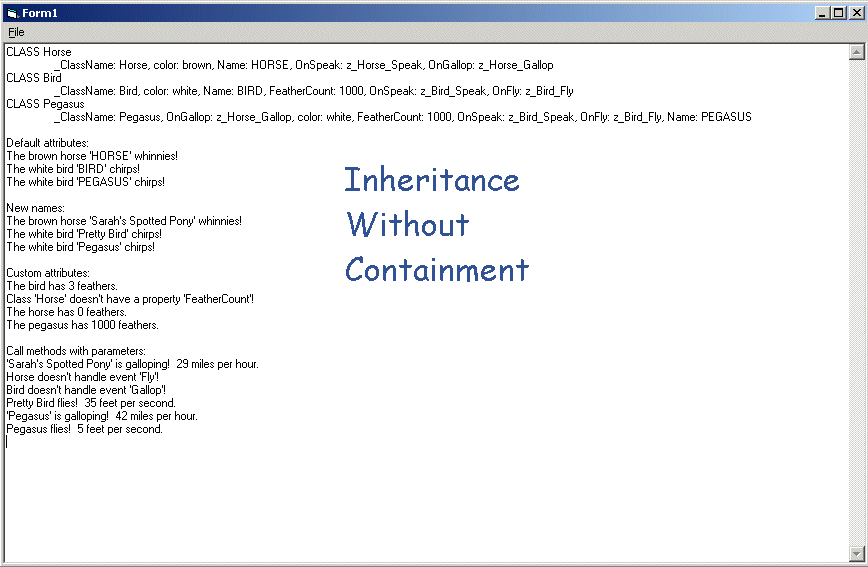



## Inheritance Without Containment

### Description

This example illustrates how to set up inheritance in VB, without using containment ('has-a') processing. The data structure is very flexible, as each class and object instance is basically a hash table (a dictionary in VB). It usess 'CallByName' to call the appropriate routine based on type, at runtime. Note that this could be made much more efficient and speedy by using a custom hash table class and enums instead of strings for properties, but I left that out to simplify this example.
 
### More Info
 

             |
---                |---
**Submitted On**   |2003-10-17 05:53:58
**By**             |[Kamilche](https://github.com/Planet-Source-Code/PSCIndex/blob/master/ByAuthor/kamilche.md)
**Level**          |Advanced
**User Rating**    |5.0 (10 globes from 2 users)
**Compatibility**  |VB 6\.0
**Category**       |[Object Oriented Programming \(OOP\)](https://github.com/Planet-Source-Code/PSCIndex/blob/master/ByCategory/object-oriented-programming-oop__1-47.md)
**World**          |[Visual Basic](https://github.com/Planet-Source-Code/PSCIndex/blob/master/ByWorld/visual-basic.md)
**Archive File**   |[Inheritanc16598110172003\.zip](https://github.com/Planet-Source-Code/kamilche-inheritance-without-containment__1-49283/archive/master.zip)

